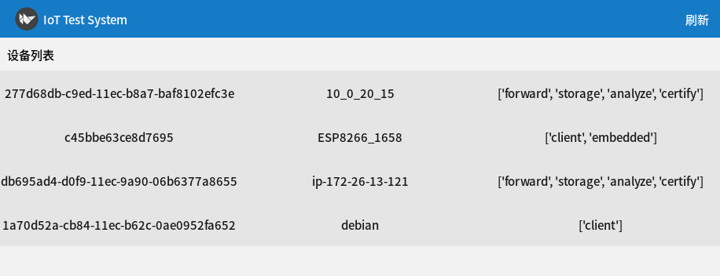
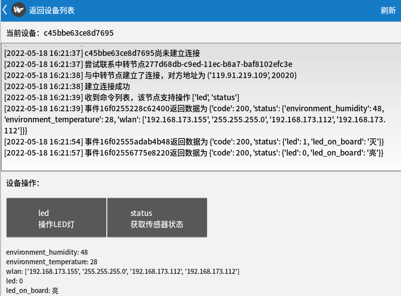
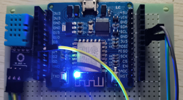
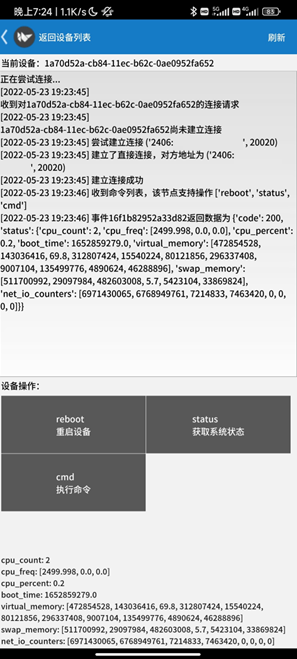

## IoT Test System

### Introduction

**物联网智能家居通信控制系统的设计与实现**

课题提出在分布式系统上搭建的物联网智能家居通信控制系统。系统包含服务节点、终端节点及用户控制节点三大部分。服务节点维护分布式网络信息，为其他节点提供数据转发服务。终端节点设备与传感器和控制器相连，并接入网络，接受并处理查询和管理操作。用户在移动设备及桌面设备运行管理程序，发现节点网络信息，与终端设备建立双向通信，查询终端及传感器数据，对终端设备或与其相连的器件下发控制命令。通信控制系统使用Python实现终端节点程序和服务节点程序，使用Python及跨平台的Kivy GUI框架实现用户管理节点程序，使用MicroPython编程语言、ESP8266开发板及DHT11传感器实现嵌入式节点模型。

课题探究了部分场景的适配问题，如连接质量监测、终端数据转发、IPv6等。考虑服务的可扩展性，将分布式的服务节点分为若干种角色，为其他节点提供差异化的服务。

### This Repository

为系统的简单初步实现。

服务节点：[node.py](https://github.com/ningzichun/IoT-Test-System/blob/main/client.py)

终端节点：[client.py](https://github.com/ningzichun/IoT-Test-System/blob/main/client.py), [device.py](https://github.com/ningzichun/IoT-Test-System/blob/main/device.py)

ESP8266嵌入式终端节点：[esp8266](https://github.com/ningzichun/IoT-Test-System/tree/main/esp8266)文件夹

用户控制节点：[user](https://github.com/ningzichun/IoT-Test-System/tree/main/user)文件夹

### Pictures

